# Kling Video Generation Tracker

**Settings:** Image-to-video · 5s · Standard · kling-v1-6 (or whatever shows cheapest)

**For each room:**
1. Upload the image shown
2. Copy/paste the prompt below it
3. Generate · Download the MP4
4. Save it exactly as `{name}.mp4` in `businesses/public/assets/videos/`
5. Tick the box

**Check progress from terminal:**

```bash
ls businesses/public/assets/videos/ 2>/dev/null | sort
```

Or one-line diff of what's left:

```bash
for n in jax hank vega brix doss vault signalscout forge max echo iris rex nova pixel zenith atlas neo; do \
  [ -f businesses/public/assets/videos/$n.mp4 ] && echo "DONE $n" || echo "TODO $n"; \
done
```

---

## 1. jax — [ ]

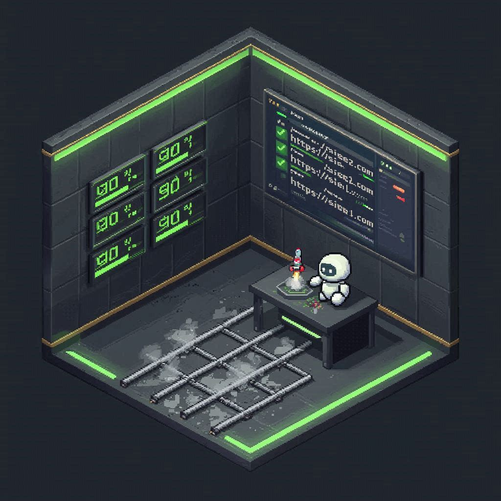

**Image:** `businesses/public/assets/rooms/jax.jpg` → save as `businesses/public/assets/videos/jax.mp4`

```
The robot slowly types at the desk, head bobs, orange screens flicker, lamp sways, dust particles float, everything else stays still
```

---

## 2. hank — [ ]

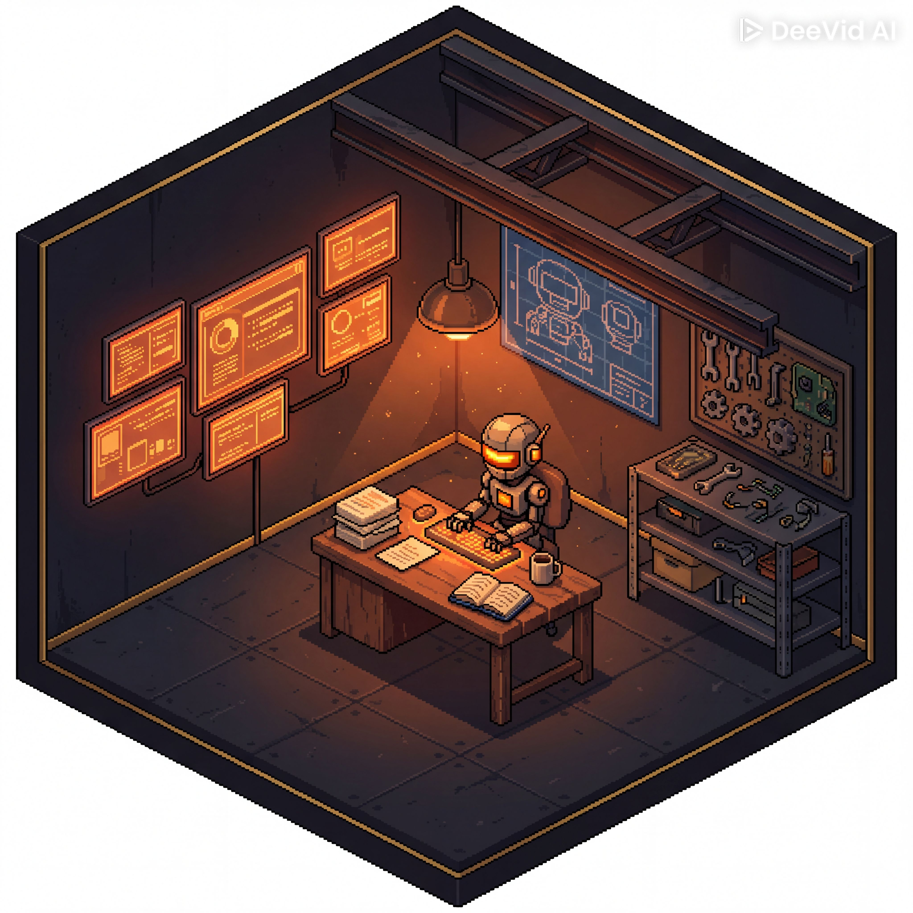

**Image:** `businesses/public/assets/rooms/hank.jpg` → save as `businesses/public/assets/videos/hank.mp4`

```
The robot paces slowly, teal radar screens sweep, map pins blink, antenna light pulses, everything else stays still
```

---

## 3. vega — [ ]

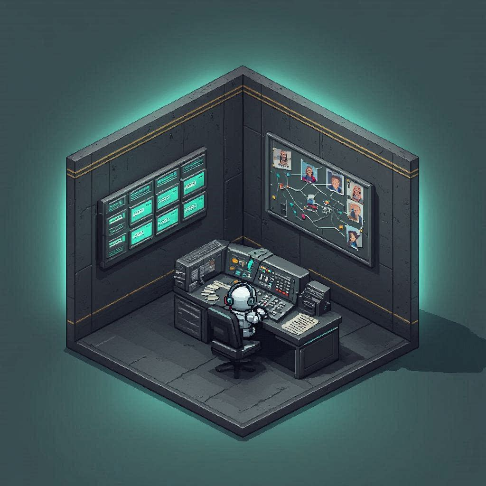

**Image:** `businesses/public/assets/rooms/vega.jpg` → save as `businesses/public/assets/videos/vega.mp4`

```
The robot gestures at floating charts, bar graphs animate upward, revenue arrow pulses green, data scrolls on screens, everything else stays still
```

---

## 4. brix — [ ]

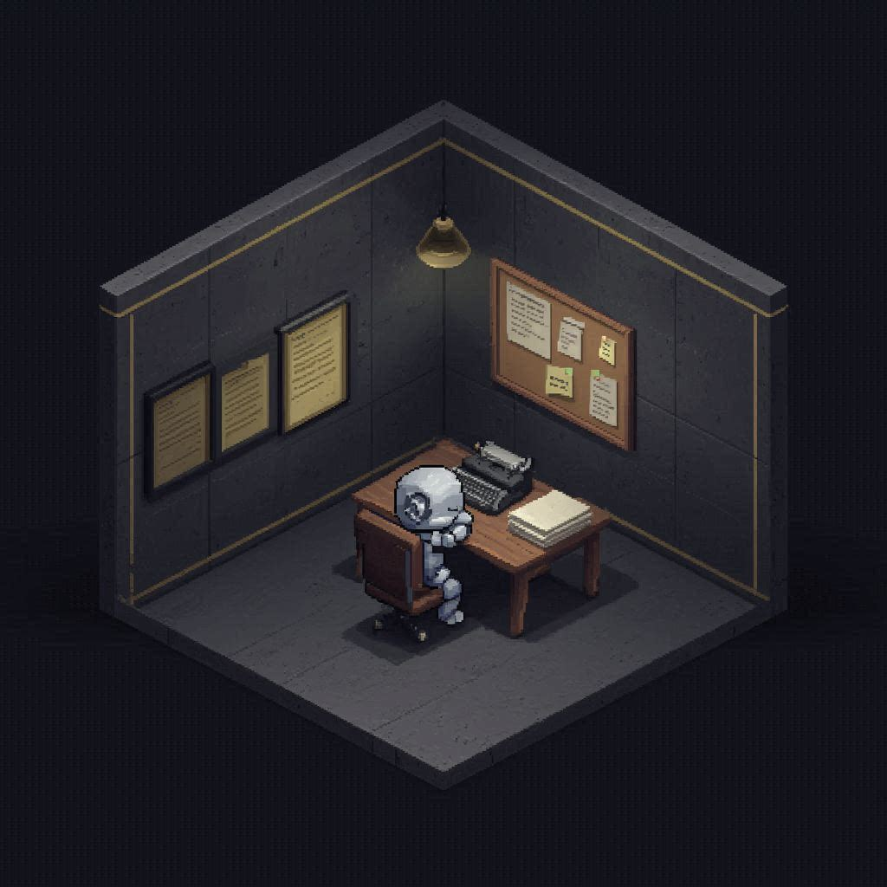

**Image:** `businesses/public/assets/rooms/brix.jpg` → save as `businesses/public/assets/videos/brix.mp4`

```
The robot crawls along floor checking cables, server lights blink in sequence, purple screens flicker, cables pulse with orange energy, sparks drift upward, everything else stays still
```

---

## 5. doss — [ ]

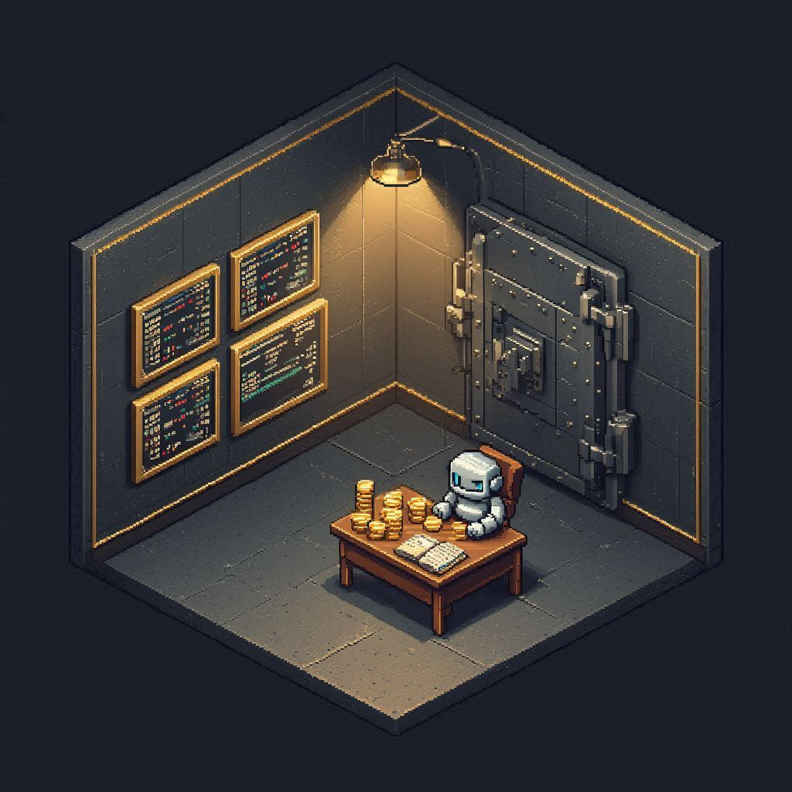

**Image:** `businesses/public/assets/rooms/doss.jpg` → save as `businesses/public/assets/videos/doss.mp4`

```
The armored robot slowly rotates scanning, camera feeds cycle on screens, world map checkmarks pulse one by one, vault hatch glows green, everything else stays still
```

---

## 6. vault — [ ]

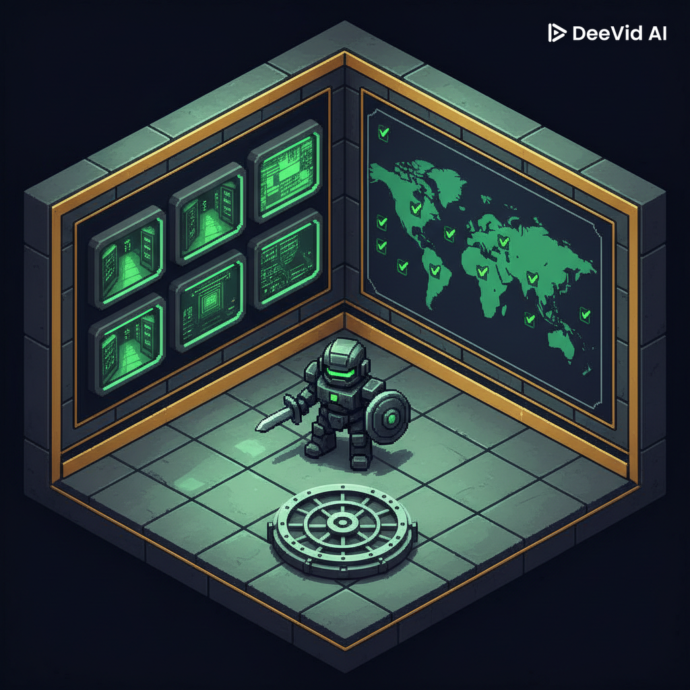

**Image:** `businesses/public/assets/rooms/vault.png` → save as `businesses/public/assets/videos/vault.mp4`

```
The robot counts gold coins moving them one by one, vault door handle rotates slightly, financial charts tick upward, lamp swings gently, everything else stays still
```

---

## 7. signalscout — [ ]

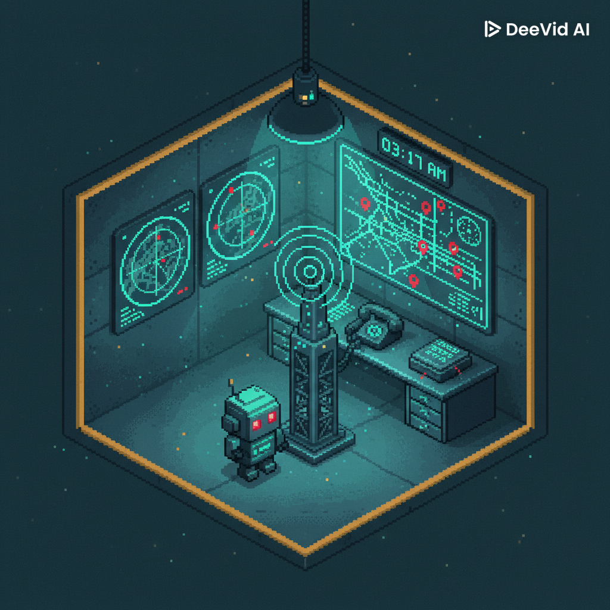

**Image:** `businesses/public/assets/rooms/signalscout.png` → save as `businesses/public/assets/videos/signalscout.mp4`

```
The robot adjusts broadcast console dials, radar circles sweep continuously, target pins blink on city map, antenna light blinks rhythmically, everything else stays still
```

---

## 8. forge — [ ]

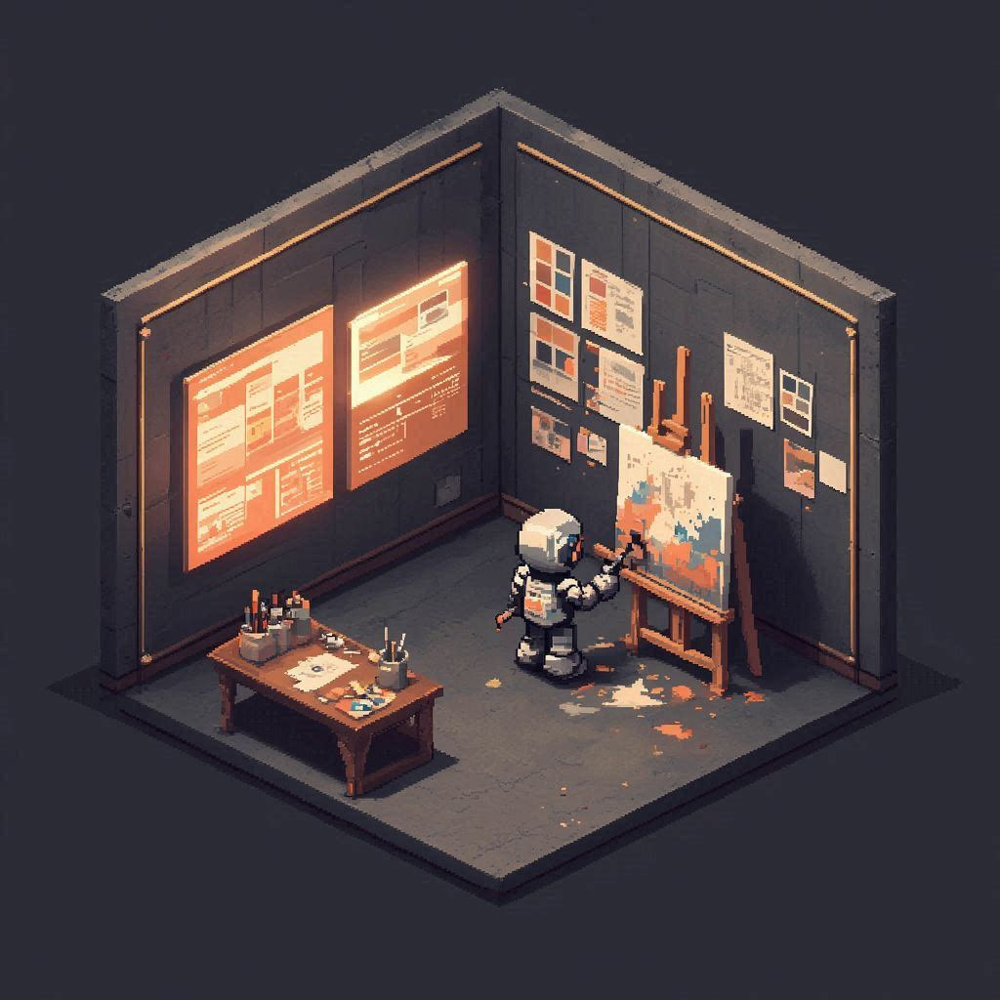

**Image:** `businesses/public/assets/rooms/forge.jpg` → save as `businesses/public/assets/videos/forge.mp4`

```
The robot raises paintbrush and makes a stroke on canvas, paint splatters appear on floor, mockup screens fade between layouts, color swatches glow, everything else stays still
```

---

## 9. max — [ ] — NEEDS SOURCE IMAGE

No `max.jpg` in `assets/rooms/` yet. Generate one first (or use any existing image that fits the scene), then save it as `businesses/public/assets/rooms/max.jpg` before running this prompt.

```
The rocket slowly lifts off from launchpad with smoke and sparks, green progress bars fill one by one, website URLs get green checkmarks in sequence, everything else stays still
```

**Save result as:** `businesses/public/assets/videos/max.mp4`

---

## 10. echo — [ ]

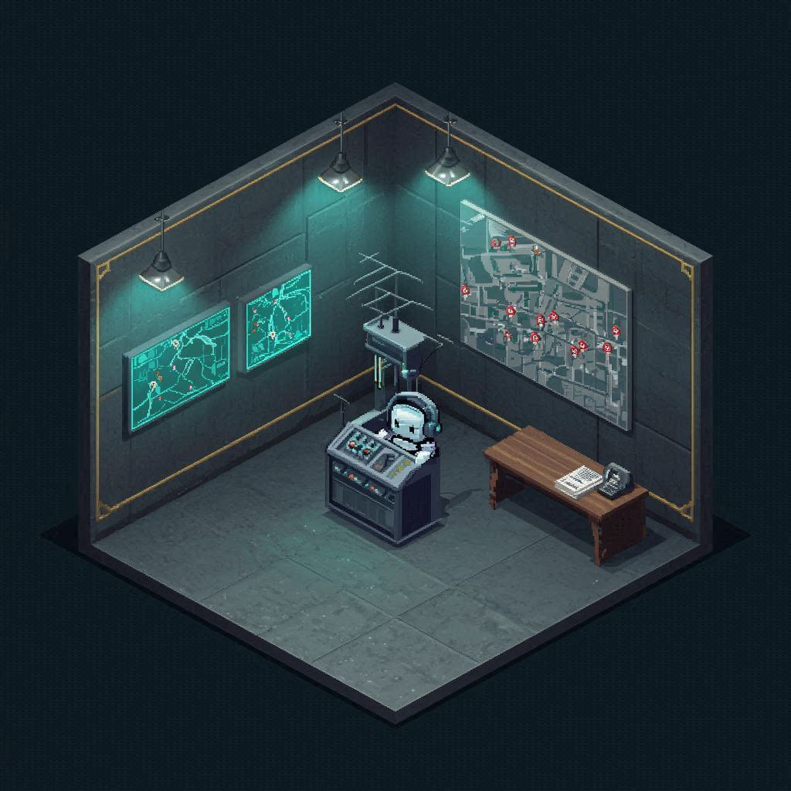

**Image:** `businesses/public/assets/rooms/echo.jpg` → save as `businesses/public/assets/videos/echo.mp4`

```
The robot presses switchboard buttons, teal delivery confirmations appear on screens, detective board string connects cards, telephone light blinks, everything else stays still
```

---

## 11. iris — [ ]

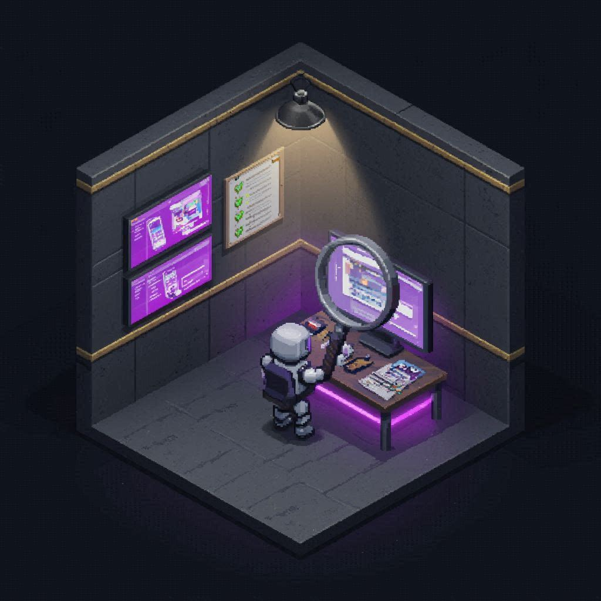

**Image:** `businesses/public/assets/rooms/iris.jpg` → save as `businesses/public/assets/videos/iris.mp4`

```
The robot moves magnifying glass across the website screen, audit screens cycle between mobile and desktop, checklist gets checkmarks added, purple underglow pulses, everything else stays still
```

---

## 12. rex — [ ] — NEEDS SOURCE IMAGE

No `rex.jpg` in `assets/rooms/` yet. Generate one first, then save it as `businesses/public/assets/rooms/rex.jpg` before running this prompt.

```
The robot slowly droops asleep then snaps awake, typewriter keys press one at a time, corkboard papers rustle, lamp flickers, everything else stays still
```

**Save result as:** `businesses/public/assets/videos/rex.mp4`

---

## 13. nova — [ ]

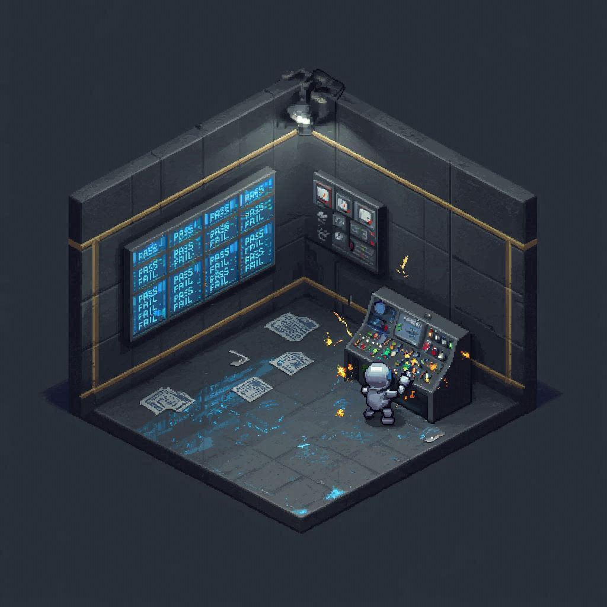

**Image:** `businesses/public/assets/rooms/nova.jpg` → save as `businesses/public/assets/videos/nova.mp4`

```
The robot frantically presses buttons, sparks fly in bursts, PASS FAIL results flash rapidly, papers scatter on floor, blue electric arcs crawl across floor, everything else stays still
```

---

## 14. pixel — [ ] — NEEDS SOURCE IMAGE

No `pixel.jpg` in `assets/rooms/` yet. Generate one first, then save it as `businesses/public/assets/rooms/pixel.jpg` before running this prompt.

```
The robot pans camera left and right, TikTok screens loop with motion, ring light pulses bright and dim, editing waveforms animate, everything else stays still
```

**Save result as:** `businesses/public/assets/videos/pixel.mp4`

---

## 15. zenith — [ ]

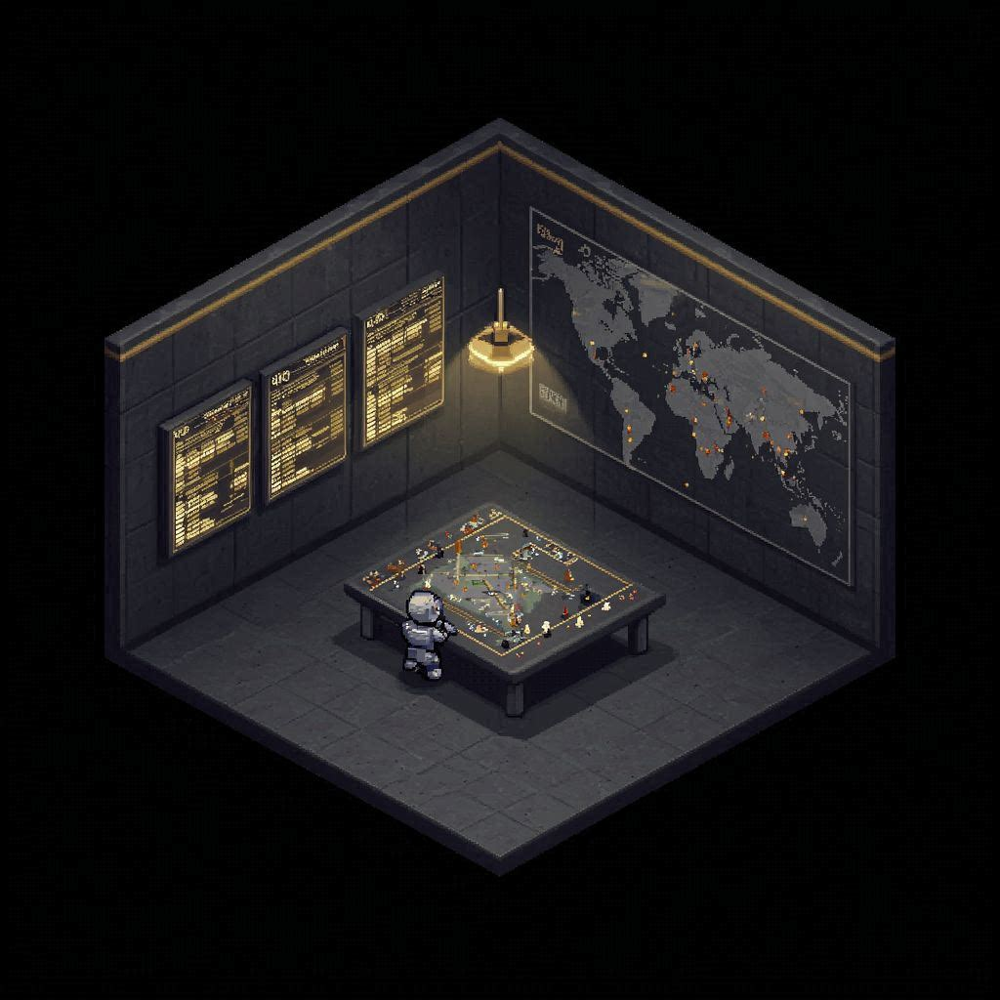

**Image:** `businesses/public/assets/rooms/zenith.jpg` → save as `businesses/public/assets/videos/zenith.mp4`

```
The robot moves chess pieces across war room table, gold timeline screens scroll forward, expansion markers light up one by one outward on world map, everything else stays still
```

---

## 16. atlas — [ ]

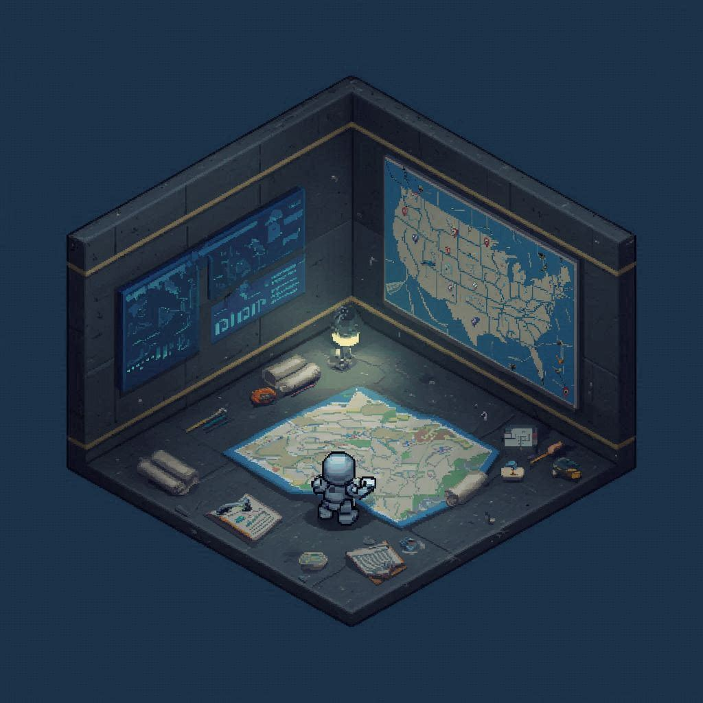

**Image:** `businesses/public/assets/rooms/atlas.jpg` → save as `businesses/public/assets/videos/atlas.mp4`

```
The robot traces routes on floor map with one finger, lantern flickers, USA wall map pins light up west to east, map scrolls partially unroll, everything else stays still
```

---

## 17. neo — [ ]

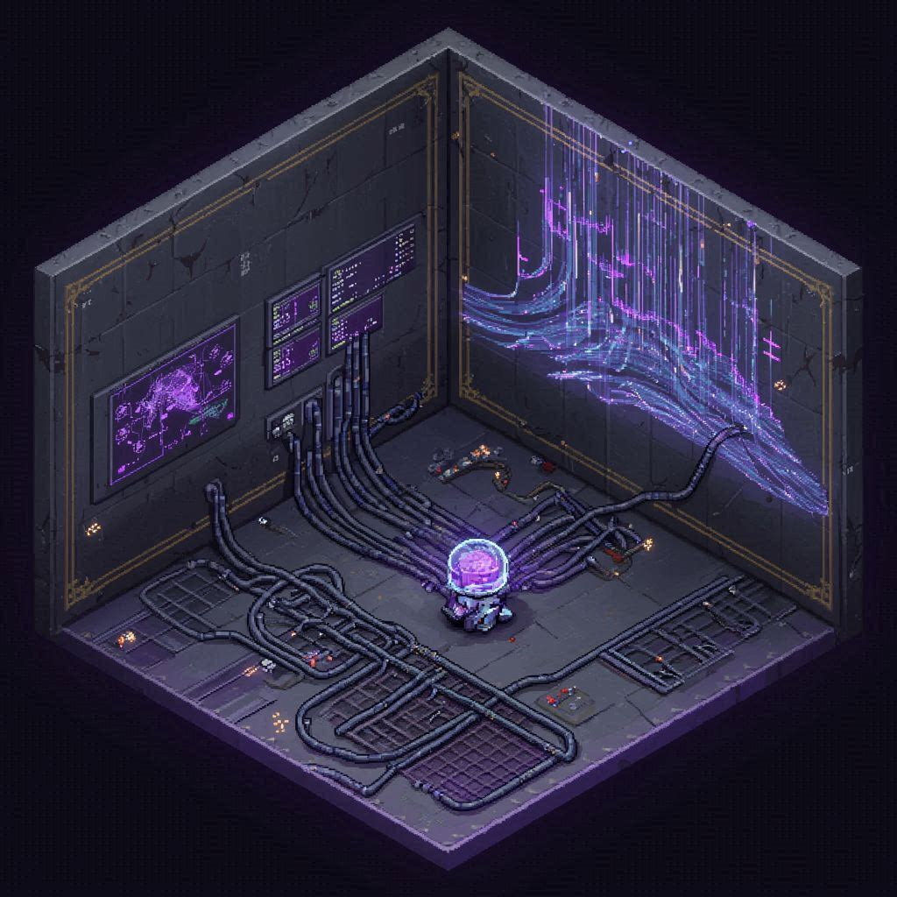

**Image:** `businesses/public/assets/rooms/neo.jpg` → save as `businesses/public/assets/videos/neo.mp4`

```
The robot rotates slowly as data cables pulse with flowing purple energy, neural network nodes light up and connect on back wall, data streams flow down walls, brain dome pulses brighter and dimmer, everything else stays still
```
